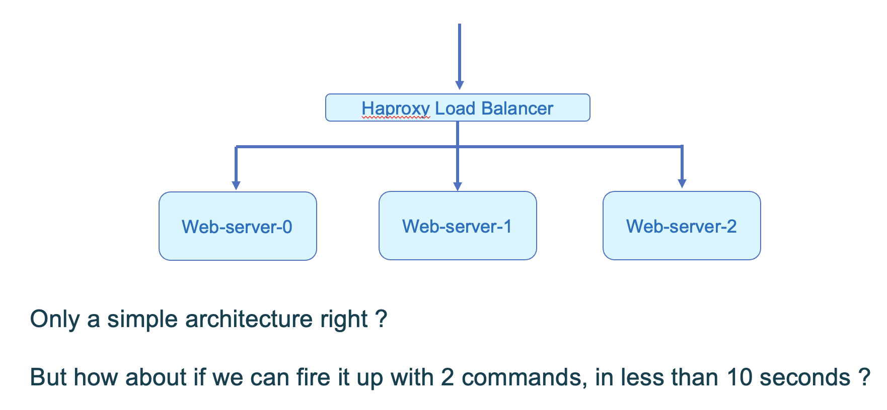

# 2023-Feb03 ArdanLabs Webinar - Creating Cloud Resources with Terraform

This folder contains the slides and source code of this 1 to 1h30 session on IaC (Infrastructure as Code),
more specifically showing how we can manage infrastructure using an IaC tool such as Terraform.

## The Scenario

The scenario which we will implement is very simple, but already shows how we can standup an infrastructure
comprised of multiple components from a configuration expressed as Code.

The chosen scenario is 3 web-servers fronted by an HAProxy LoadBalancer.



As the demo uses Docker to simulate-\* Virtual Machines, the standup is extremely rapid, less than 7 seconds
from ```terraform init``` to ```terraform apply``` (using -auto-approve to be able to measure the standup timing)

\* - **Note:** This is actually an anti-pattern, but as a training tool allows to create resources and to
    connect to them using ssh just as we would do if creating cloud VMs, but with the advantages of
    - standup at lightning speed - allowing to quickly learn about Terraform
    - independence of any cloud provider
 
## The Steps

In the webinar we progress through the following steps adding features

0. init
  - Demonstrate fundamental examples of working with Terraform variables

1. pseudo_vm
  - Create a single pseudo VM which runs a very basic web-server
  - Create an ssh key allowing ssh access to the pseudo VM
  - More elaborate output variable calculations

2. count
  - Extend the config to use the count special variable to create multiple web-servers
  - Use templatefile function to create unique index.html for each web-server
  - Adapt ssh/curl commands to multiple web-server VMs

3. load-bal
  - Add a front-end HAProxy LoadBalancer as a "normal" Docker container
  - Create haproxy.cfg from template, pointing to 3 web-servers

## Running the Step3 demo

1. Timing the infrastructure creation

To time the infrastructure creation, including config ```terraform init``` we run the following command:

```time { terraform init; terraform apply -auto-approve; } ```

2. Observing the HAProxy LoadBalancer Dashboard

Assuming that you have access to ports on the server running Docker, Terraform on the localhost address, for example.

Browse to the dashboard at http://127.0.0.1:8404

#### Observe the dashboard
- note the webserver section with our 3 web-servers ```s1```, ```s2```, ```s3```
- note that the session counts, bytes in/out values are initially zero

#### Create some traffic

Open the load balancer address http://127.0.0.1:8000 in a web browser

Refresh the page many times

#### Observe the dashboard
- note that the session counts, bytes in/out values indicate traffic routed toward the 3 web-servers

## Tear down the infrastructure

```time terraform destroy```


